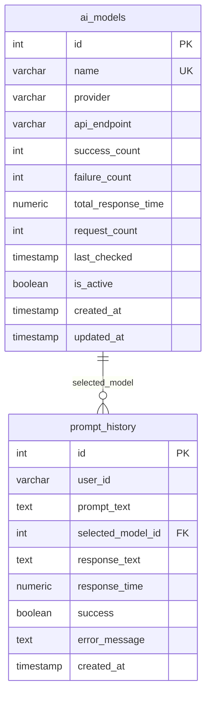

# Database Schema

> Документация по структуре базы данных Free AI Selector.

## ER-диаграмма



---

## Таблица: ai_models

Хранит информацию об AI-моделях и их статистику.

### Columns

| Column | Type | Constraints | Description |
|--------|------|-------------|-------------|
| `id` | INTEGER | PK, AUTO | Уникальный идентификатор |
| `name` | VARCHAR(255) | UNIQUE, NOT NULL | Имя модели |
| `provider` | VARCHAR(100) | NOT NULL | Имя провайдера |
| `api_endpoint` | VARCHAR(500) | NOT NULL | URL API |
| `success_count` | INTEGER | DEFAULT 0 | Успешные запросы |
| `failure_count` | INTEGER | DEFAULT 0 | Неудачные запросы |
| `total_response_time` | NUMERIC(10,3) | DEFAULT 0.0 | Сумма времени ответов |
| `request_count` | INTEGER | DEFAULT 0 | Всего запросов |
| `last_checked` | TIMESTAMP | NULL | Последняя проверка |
| `is_active` | BOOLEAN | DEFAULT TRUE | Активна ли модель |
| `created_at` | TIMESTAMP | DEFAULT NOW() | Время создания |
| `updated_at` | TIMESTAMP | DEFAULT NOW() | Время обновления |

### Indexes

| Index | Columns | Type | Purpose |
|-------|---------|------|---------|
| `ix_ai_models_name` | name | UNIQUE | Быстрый поиск по имени |
| `ix_ai_models_provider` | provider | BTREE | Фильтрация по провайдеру |
| `ix_ai_models_is_active` | is_active | BTREE | Фильтрация активных |

### Computed Properties (в Domain Model)

Эти свойства вычисляются в Python, не хранятся в БД:

```python
success_rate = success_count / request_count
average_response_time = total_response_time / request_count
speed_score = max(0, 1.0 - average_response_time / 10.0)
reliability_score = (success_rate * 0.6) + (speed_score * 0.4)
```

---

## Таблица: prompt_history

Хранит историю всех промптов и ответов.

### Columns

| Column | Type | Constraints | Description |
|--------|------|-------------|-------------|
| `id` | INTEGER | PK, AUTO | Уникальный идентификатор |
| `user_id` | VARCHAR(255) | NOT NULL | ID пользователя |
| `prompt_text` | TEXT | NOT NULL | Текст промпта |
| `selected_model_id` | INTEGER | NOT NULL, FK | ID выбранной модели |
| `response_text` | TEXT | NULL | Текст ответа |
| `response_time` | NUMERIC(10,3) | NOT NULL | Время ответа (сек) |
| `success` | BOOLEAN | NOT NULL | Успешен ли запрос |
| `error_message` | TEXT | NULL | Сообщение об ошибке |
| `created_at` | TIMESTAMP | DEFAULT NOW() | Время создания |

### Indexes

| Index | Columns | Type | Purpose |
|-------|---------|------|---------|
| `ix_prompt_history_user_id` | user_id | BTREE | История по пользователю |
| `ix_prompt_history_selected_model_id` | selected_model_id | BTREE | История по модели |
| `ix_prompt_history_success` | success | BTREE | Фильтрация по успешности |
| `ix_prompt_history_created_at` | created_at | BTREE | Сортировка по времени |

### Foreign Keys

| Column | References | On Delete |
|--------|------------|-----------|
| `selected_model_id` | `ai_models.id` | RESTRICT |

---

## Миграции

Миграции управляются через Alembic:

```bash
# Путь к миграциям
services/aimanager_data_postgres_api/alembic/versions/

# Текущая миграция
20250117_0001_initial_schema.py
```

### Создание новой миграции

```bash
# Внутри контейнера Data API
docker compose exec aimanager_data_postgres_api alembic revision --autogenerate -m "description"
```

### Применение миграций

```bash
make migrate
# или
docker compose exec aimanager_data_postgres_api alembic upgrade head
```

---

## Seed Data

Начальные данные загружаются через:

```bash
make seed
```

Seed содержит 6 AI-моделей:

```python
# services/aimanager_data_postgres_api/app/infrastructure/database/seed.py

INITIAL_MODELS = [
    {
        "name": "Gemini 2.5 Flash",
        "provider": "GoogleGemini",
        "api_endpoint": "https://generativelanguage.googleapis.com/v1beta",
        "is_active": True,
    },
    {
        "name": "Llama 3.3 70B (Groq)",
        "provider": "Groq",
        "api_endpoint": "https://api.groq.com/openai/v1",
        "is_active": True,
    },
    # ... остальные модели
]
```

---

## SQLAlchemy Models

### ORM Model

```python
# services/aimanager_data_postgres_api/app/infrastructure/database/models.py

from sqlalchemy import Column, Integer, String, Boolean, Numeric, DateTime
from sqlalchemy.orm import declarative_base

Base = declarative_base()


class AIModelORM(Base):
    """SQLAlchemy ORM модель для ai_models."""

    __tablename__ = "ai_models"

    id = Column(Integer, primary_key=True, autoincrement=True)
    name = Column(String(255), unique=True, nullable=False, index=True)
    provider = Column(String(100), nullable=False, index=True)
    api_endpoint = Column(String(500), nullable=False)
    success_count = Column(Integer, default=0)
    failure_count = Column(Integer, default=0)
    total_response_time = Column(Numeric(10, 3), default=0.0)
    request_count = Column(Integer, default=0)
    last_checked = Column(DateTime, nullable=True)
    is_active = Column(Boolean, default=True, index=True)
    created_at = Column(DateTime, server_default=func.now())
    updated_at = Column(DateTime, server_default=func.now(), onupdate=func.now())
```

### Domain Model

```python
# services/aimanager_data_postgres_api/app/domain/models.py

@dataclass
class AIModel:
    """Domain Entity с бизнес-логикой."""

    id: Optional[int]
    name: str
    provider: str
    # ... остальные поля

    @property
    def reliability_score(self) -> float:
        """Вычисляемое свойство."""
        return (self.success_rate * 0.6) + (self.speed_score * 0.4)
```

---

## Backup & Restore

### Backup

```bash
docker compose exec postgres pg_dump -U aimanager aimanager > backup.sql
```

### Restore

```bash
docker compose exec -T postgres psql -U aimanager aimanager < backup.sql
```

---

## Related Documentation

- [Reliability Formula](reliability-formula.md) - Формула расчёта
- [../operations/deployment.md](../operations/deployment.md) - Деплой и миграции
- [../ai-context/SERVICE_MAP.md](../ai-context/SERVICE_MAP.md) - Карта сервисов
