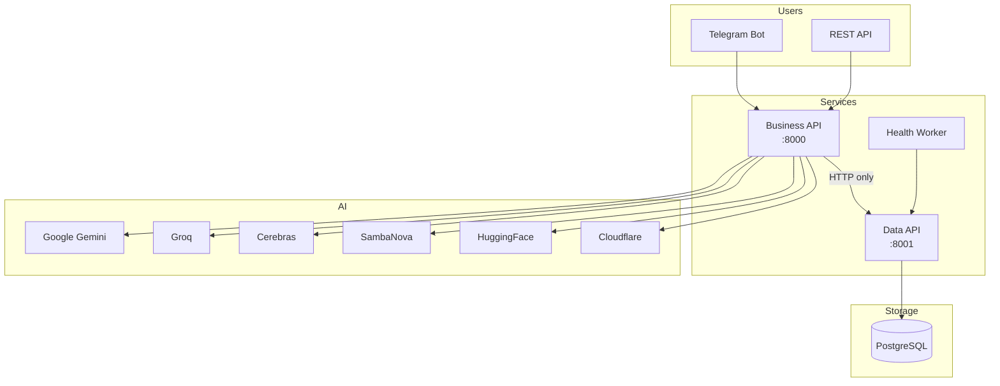

# Free AI Selector - Project Overview

## Что это такое

**Free AI Selector** — платформа маршрутизации AI, которая автоматически выбирает лучшую бесплатную AI-модель для обработки запросов пользователей.

## Проблема

Существует множество бесплатных AI API (Google Gemini, Groq, Cerebras, etc.), но:

- Каждый имеет разные rate limits
- Доступность нестабильна
- Скорость ответа варьируется
- Качество ответов отличается

**Решение:** Автоматический выбор лучшей модели на основе метрик надёжности.

## Ключевые особенности

### 1. Автоматический выбор модели

Система рассчитывает `reliability_score` для каждой модели и выбирает лучшую:

```
reliability_score = (success_rate × 0.6) + (speed_score × 0.4)
```

### 2. Fallback механизм

При ошибке первичной модели система автоматически переключается на следующую по рейтингу.

### 3. Синтетический мониторинг

Health Worker каждый час проверяет все провайдеры и обновляет статистику.

### 4. 6 бесплатных провайдеров

Все провайдеры работают без кредитной карты:

| Провайдер | Модель | Особенности |
|-----------|--------|-------------|
| Google Gemini | Gemini 2.5 Flash | 10 RPM, высокое качество |
| Groq | Llama 3.3 70B | До 1800 tokens/sec |
| Cerebras | Llama 3.3 70B | 1M tokens/day |
| SambaNova | Llama 3.3 70B | 20 RPM |
| HuggingFace | Llama 3 8B | 300+ моделей |
| Cloudflare | Llama 3.3 70B | 10K neurons/day |

## Архитектура



### Ключевой принцип: HTTP-Only Data Access

Business API **никогда** не обращается к БД напрямую — только через HTTP к Data API.

Это обеспечивает:

- Слабую связанность между сервисами
- Возможность независимого масштабирования
- Единую точку доступа к данным

## Основные компоненты

### Business API (Port 8000)

- Выбор лучшей AI-модели
- Генерация ответов через провайдеры
- Fallback при ошибках
- Обновление статистики

### Data API (Port 8001)

- CRUD для AI-моделей
- История промптов
- Статистика использования

### Telegram Bot

- Пользовательский интерфейс
- Русский язык
- Inline-кнопки

### Health Worker

- Почасовой мониторинг
- Синтетические тесты
- Автообновление статистики

## Quick Start

```bash
# 1. Clone
git clone https://github.com/xxx/free-ai-selector.git
cd free-ai-selector

# 2. Configure
cp .env.example .env
# Edit .env with your API keys

# 3. Run
make build
make up
make seed

# 4. Test
curl http://localhost:8000/api/v1/prompts/process \
  -H "Content-Type: application/json" \
  -d '{"prompt": "Hello, AI!"}'
```

## Related Documentation

- [AI Providers](ai-providers.md) - Детали провайдеров
- [Reliability Formula](reliability-formula.md) - Формула расчёта
- [Database Schema](database-schema.md) - Структура БД
- [../api/business-api.md](../api/business-api.md) - API Reference
